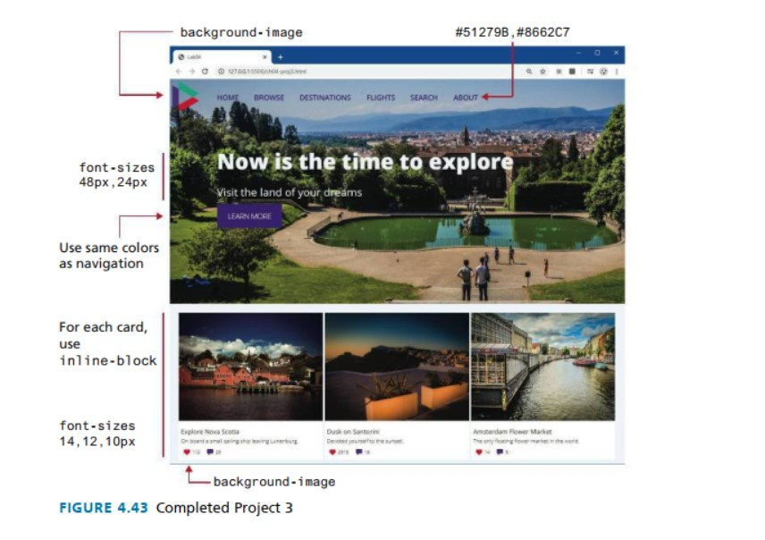

# Lab 01 | Home Page Prototype  

## Table of Contents

1. [Overview](#overview)
2. [Instructions](#instructions)
   1. [Open the Replit Classroom](#open-the-replit-classroom)
   2. [Examine the Files](#examine-the-files)
   3. [Style the Header](#style-the-header)
   4. [Add the Logo](#add-the-logo)
   5. [Style the Navigation Links](#style-the-navigation-links)
   6. [Adjust the Navigation Margin](#adjust-the-navigation-margin)
   7. [Style the Links](#style-the-links)
   8. [Position the Hero Text](#position-the-hero-text)
   9. [Style the Hero Text](#style-the-hero-text)
   10. [Style the Hero Button](#style-the-hero-button)
   11. [Style the Cards](#style-the-cards)
   12. [Style the Card Content](#style-the-card-content)
   13. [Add Icons for Comments and Favorites](#add-icons-for-comments-and-favorites)
3. [Guidance and Testing](#guidance-and-testing)
4. [Bonus Points](#bonus-points)
5. [Submission](#submission)
6. [Getting Started with GitHub and Codespaces](#getting-started-with-github-and-codespaces)
   1. [Step 1: Fork the Repository](#step-1-fork-the-repository)
   2. [Step 2: Open the Repository in Codespaces](#step-2-open-the-repository-in-codespaces)
   3. [Step 3: Complete the Lab Assignment](#step-3-complete-the-lab-assignment)
   4. [Step 4: Submit Your Work via Pull Request](#step-4-submit-your-work-via-pull-request)
   5. [Additional Steps](#additional-steps)

## Overview

In this project, you will make use of your knowledge of CSS to create a sample home
page with navigation, large hero image, and three “card” boxes.

The goal of this lab will be to practice using CSS and HTML to create a simple home page. You will
be using the HTML and CSS files provided in the Replit classroom. You will be editing the CSS file to
style the HTML file. You will be using the browser to test your work.

_Note_ You should be able to complete this lab without making changes to the `index.html` file.



## Instructions

1. Open the Replit classroom for this lab. You will see two files: `index.html` and `style.css`.
2. Examine the `index.html` file. You can use the WebView browser in Replit, or view the page in an external browser tab/window.
3. Examine the `style.css` file. You will be adding CSS rules to this file to style the HTML file.
4. First, let's style the `<header>` element. Set the background-image to the image in the `images` folder. Set the background-size to cover. Set the width of the `<header>` to 100% and its min-height to 500px.
5. Next, add the logo in the top-left corner as a background-image to the `<nav>` element. Set its size to about 60px. The padding and height of the `<nav>` will also have to be set based on the size of the logo. Also make sure the logo image does not repeat.

```css
nav {
  background-image: url(images/logo.svg);
  background-size: 60px;
  background-repeat: no-repeat;
  background-position: 10px 5px;
  padding: 20px;
  height: 100px;
}
```

6. Now, style the navigation links. For each list item in the `<nav>` element, remove the list bullets by setting the list-style-type to none. Make the list horizontal by setting the display property of each `<li>` to inline-block. Set the link, visited, and hover colors of the navigation links.

```css
nav li {
  display: inline-block;
  list-style-type: none;
}
```

7. Set the margin of the `ul` within the `<nav>` to move the `ul` left of the logo, so it's elements do not overlap the logo.

```css
nav ul {
  margin-left: 80px;
}
```

8. We'll also need to make sure the links are styled correctly. We can do this by using the `a` selector. We can also use the `:visited`, and `:hover` pseudo-classes to style the links when they are in different states. We can also use the `:active` pseudo-class to style the link when it is being clicked.

```css
nav a {
  color: #51279b;
  text-decoration: none;
  padding: 10px;
  font-weight: 600;
}

nav a:visited {
  color: #8662c7;
}

nav a:hover {
  color: #8662c7;
  text-decoration: underline;
}
```

9. Now, we can move on to the text in the center of the hero. Set the margin of the `<div>` within the `<header>` to position it roughly in the vertical middle of the big photo. Set its left margin so it is aligned with the navigation.

```css
header div {
  margin: 100px 0 0 80px;
}
```

10. Then we need to style the hero text. Per the mockup, it should be white, and the font size should be 48px for the `<h2>` element and 24px for the `<p>` element.

```css
header div {
    margin: 100px 0 0 80px;
    color: white; /* we can use the cascading nature of CSS to set the color for all the elements within the div */
}
header h2 {
  font-size: 48px;
  margin-bottom: 0.5rem;
}
header p {
  font-size: 24px;
  margin-bottom: 1.5rem;
}
```

11. There is a button in the hero, so we need to style that next. The button is nothing more than an anchor tag with a background color, and some padding. We can also use the `:hover` pseudo-class to style the button when the user hovers over it.

```css
/* We can to target header.div.a because if we taget simply a, then these styles will affect our navigation links as well */
header div a {
  background-color: #51279b;
  color: white;
  padding: 10px 20px;
  text-decoration: none;
  border-radius: 5px;
}

header div a:hover {
    background-color: #8662c7;
}
```

12. Now we need to style the cards. The card `<div>` elements need to be on a single line, so set the display property of each card to float left. For the `<div>` within the card (and its contents), set their padding and margins to get a similar appearance as Figure 4.43.

```css
/* Note we can use the .card class selector here, as a class has been assigned to the <section> elements. */
.card {
  float: left;
  display: inline-block;
  width: calc(33% - 10px);
  margin: 10px 5px;
  background-color: white;
}
```

13. Now we can style the card content. The card content should be left aligned, but we need to add a bit of padding around it. The image also needs to be full width, to expand to the width of it's parent container. The `div.description` element needs to have a font size of 12px, and the `h3` element needs to have a font size of 14px.

```css
.card div {
    padding: 20px 5px;
}

.card img {
    width: 100%;
}

.card div.description {
    font-size: 12px;
}

.card h3 {
    font-size: 14px;
}
```

14. Let's add the icons for the comments and favorites. First, target the `.social` class selector. We'll add a margin top of 1rem, and set the font size to 12px per the mockup.

Next, let's target both of the `.social span` elements. The styles between the comment and the heart icon are very similar, so we save some keystrokes by targeting the most generic selector. The only difference between the `.heart` and `.comment` elements are their background images.
We'll need to set the background image size for the `.social span` to contain, and ensure the image does not repeat. We should also add a small padding to the left of the icons, so they are not right up against the text, and some small margin to the right of the icons, so they are not right up against each other.

```css
.social {
  margin-top: 1rem;
  font-size: 12px;
}

.social span {
  background-size: contain;
  background-repeat: no-repeat;
  padding-left: 25px;
  margin-right: 10px; /* we could use use 1em here, but 10px is a bit more precise */
}

.social .heart {
  background-image: url(./images/heart.png);
}

.social .comment {
  background-image: url(./images/comment.png);
}
```

15. Finally, on your own, try and refactor the `main > .card` in such a way where the parent `main` element uses flexbox to manage the layout of the children `.cards` instead of floats. Because we have written the cards to use percentage widths, there is a small gap at the end of the cards on the right. Can you use flexbox to remove the gap? 


#### Figure 4.43

-----

## Guidance and Testing

1. The steps above should walk you through creating the layout to match the mockup. You can review the video walkthrough for further guidance.

## Submission

Once you have completed the lab, please submit your code to the Replit classroom. You can do this by clicking the "Share" button in the top right corner of the Replit editor. Then, click the "Share to Classroom" button. You should see a list of classes that you are enrolled in. Select the class that you are enrolled in and click the "Share" button. You should see a message that your code has been shared with the class. You can now close the share window.

## Getting Started with GitHub and Codespaces

Welcome to the course! In this guide, you’ll learn how to set up your coding environment using GitHub and Codespaces. By following these steps, you’ll be able to work on your lab assignments, write and test your code, and submit your work for review. Let's get started!

### Step 1: Fork the Repository

Forking a repository means making a copy of it under your GitHub account. This allows you to make changes without affecting the original project.

1. **Open the Repository**: Start by navigating to the GitHub repository link provided by your instructor.
2. **Click "Fork"**: In the top-right corner, find the “Fork” button and click it.
3. **Select Your Account**: Choose your GitHub account as the destination for the fork. Once done, you’ll be redirected to your forked copy of the repository.

   > **Tip**: Make sure you’re logged into your GitHub account, or you won’t see the option to fork!

### Step 2: Open the Repository in Codespaces

With your forked repository ready, you can now set up a development environment using Codespaces. This setup provides a pre-configured environment for you to code in, with everything you need to complete the lab.

1. **Open the Codespaces Menu**:
   - In your forked repository, click the green "Code" button, then switch to the "Codespaces" tab.
2. **Create a Codespace**:
   - Click on "Create codespace on main" to start the setup.
3. **Wait for Codespaces to Load**:
   - It may take a few minutes for Codespaces to create and configure your environment. Be patient, as it’s setting up all the tools you’ll need.
4. **Start Coding**:
   - Once the setup is complete, Codespaces will automatically open a new browser tab where your code will be ready to run. You’ll be able to see the code and any outputs as you go through the lab assignment.

### Step 3: Complete the Lab Assignment

Inside the Codespaces environment, you’ll find all the files and instructions you need. Follow the steps outlined in the README file to complete your assignment.

1. **Read the Instructions**: Carefully go through the README file to understand the tasks you need to complete.
2. **Edit the Code**: Make the necessary changes to the code files as instructed.
3. **Run and Test Your Code**: Use the terminal and editor within Codespaces to run your code and make sure everything works as expected.

   > **Hint**: If you’re stuck, try reviewing the README file again or refer to any resources provided by your instructor.

### Step 4: Submit Your Work via Pull Request

Once you’ve completed the assignment, it’s time to submit your work. You’ll do this by creating a pull request, which is a way to propose your changes to the original repository.

1. **Commit Your Changes**:
   - Save your work by committing your changes. In Codespaces, go to the Source Control panel, write a commit message, and click "Commit" to save your changes.
2. **Push to Your Fork**:
   - After committing, click "Push" to upload your changes to your forked repository on GitHub.
3. **Create a Pull Request**:
   - Go back to your GitHub repository, and you’ll see an option to “Compare & pull request.” Click it to start your pull request.
   - Include your name in the pull request description so your instructor knows who submitted it.
4. **Submit the Pull Request**:
   - Click "Create pull request" to submit your work for review. Your instructor will be notified and can review your work.

And that’s it! You’ve now completed your first lab assignment using GitHub and Codespaces. Well done!

#### Additional Steps

1. Open the terminal in Codespaces.
2. Run the following commands to install dependencies and start the development server:

    ```sh
    npm install
    npm run dev
    ```

3. You can now view the project in the browser by clicking the "Application" port in the Ports panel.

Follow the instructions in the previous sections to complete the lab.
